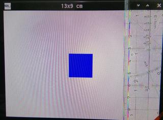
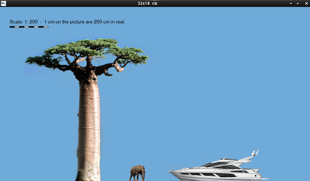
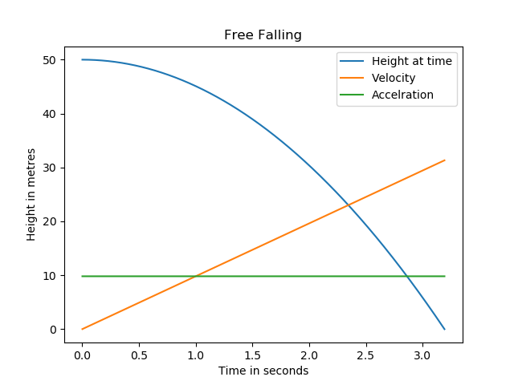
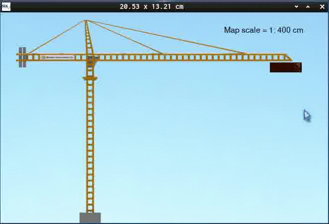
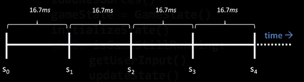
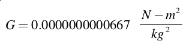
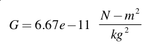
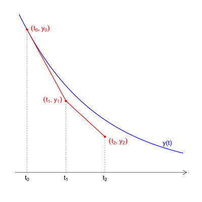
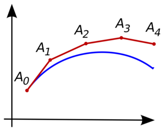

# This is a C-SDL series about physics.


No matter what type of simulation or game one starts, one needs units or World-Units and a World-Coordinate-System to measure distance and apply velocity - if it is the real world or not.

## Measurement and Scaling

### Scaling 1

Creating Objects in SI-Units.

If the program has been compiled and run, it should show a window with a blue rectangle inside. Well, that seems not very exciting and is something every beginner can do right?

But...

Scaling 1 shows how to...  

  * get display's DPI, shouldn't it be PPI?
  * set window Size in SI-Length-Unit centimeters
  * set an visual entity's sized in the same unit

  

Take a ruler and measure if the window without title is 13 time 9 centimeters and the box is 2 x 2 cm.

Hint for users of the English System: 
1 cm = 0.39370079 inches an 1 in = 2.54 cm.

`#define CENTI_PER_INCH 2.54`

Pixels, points, dots - everything the same?

Actually a Point is a mathematical (abstract) term.
A dot is for example something drawn (written) or  printed on paper (applied).
A pixel has really more meanings. It can be the the smallest rectangle of a picture during coding and runtime and it can be a tiny, projected, illuminated part (any shape) of the emitter to the display.


### Scaling 2

This program applies the knowledge from the first program.

Scaling 2 shows how to...  
  * render Textures in a real world map scaling.
  * render a scale bar with description.

  


## Motion in 1 Dimension


  
Typical Diagram of a free fall.

### Gravity
Gravity 1 shows how to...
   * calculating earth's gravity  
   * calculate falling time  
   * apply that gravity on an object  
   * press left mouse button to start falling  
   * press right mouse button to reset  
   * This Demo also shows why we need interpolation (prediction) and derivatives.  
  

### Velocity

Velocity 1 shows how to...
   * apply horizontal velocity  
   * press mouse button 1 to reset  

  

## State Integration

Integrating the Equations of Motion

The Physics on this level is really simple, not to say simplified. But, before one can move on with coding there is no reason to go in depth in physics since the low level gamestate, this is the state where visible entities appearance is defined. Points should be at the right time at the right spot. 


### Time and Steps

In most fields theoretical, practical or applied sciences one have to deal with time. Math and physics are just classic examples. For me Game Development is practical and applied (Entertainment) computer science which has to deal with time too.

Note:
I am not going into detail here on Hardware- / Linux- / POSIX API-timers, that will be a dedicated tutorial.

It should be clear that the more accurate and more precise ones gets the timing, the more realistic the simulation can get.

#### Timers & Time Resolution

Ticks and all different flavors of time.

There are a couple of things involved to get the time in our program.
Hardware clock, Operating System, Core-API  || e.g. Linux-Kernel-C-API, The C-Standard Library implementation, e.g. GLibC. And maybe another standard likes POSIX may have to be considered.

The Hardware delivers the time and the Operating System Kernel API delivers functions to query it. Since I use SDL as abstraction layer - it is a multi platform way to query the timers.

#### Hardware Sync

FPS ~ VSync - Vertical Refresh Rate

**Those 60 Hz**
Hertz is a general unit of frequency (of change in state or cycle in a sound wave, alternating current, or other cyclical waveform) of one cycle per second. A rate of change / clock / clock rate.

Nowadays most display devices are clocked at 60 Hz, I had 120 Hz Displays for a long time, now they are hard to come by - I think more refresh it is better for the eyes.

The Display swaps the Picture 60 times a second, now matter how often the GPU does.

**The Vsync**
Vertical Synchronization - it tries to synchronize (cap) the number of GPU refreshes with the display. That doesn't mean the GPU can produce more frames, just less.

Ancient Greek: σύν (sýn) means together, Ancient Greek: Κρόνος Krónos means the time, contemporaneous.

**FPS**
Frame per seconds.

Frames Per Second it is the number of times display_game() is called per second.

If I want the calculation as fast as possible no delay is demanded as in real time applications, like airbag control in a real car; one wants to eliminate every possible unnecessary calculation (overhead) to have the maximum time to distribute to urgent actions. Time resolution is one factor that makes calculation more precise.

As soon if we animate something, even a flipbook we need units lower than a second. And if we want a more realistic motion one needs more sophisticated integration methods.
 
15 / 30 / 60 FPS.

It's said that one needs 15 pictures per second to percept a fluent motion. In early morning cartoons the frame rate was 6-7, I think. That's why one can see a flickering on animations with a few f/s and it was called stop motion. Search the web for "History of animation" if you are interested.

Computer Gaming Industry formed 2 rules of thumb, so to say standards, which are 30 FPS for Simulation- / Strategy games and 60 f/s for action games.

However: In my helper I defined the vsync flag at creation:
`Renderer = SDL_CreateRenderer(Window, -1, SDL_RENDERER_ACCELERATED | SDL_RENDERER_PRESENTVSYNC);`

And since my logic and rendering is trivial for modern hardware, we won't drop under 60 f/s, except I mess up the integration or have a serious bug like infinite loops.

#### Timesteps

Submultiples of a second are:
```mono
10^-1 s	ds	decisecond 	0.1
10^-2 s	cs	centisecond	0.01
10^-3 s	ms	millisecond	0.001
10^-6 s	µs	microsecond	0.000001
10^-9 s	ns	nanosecond	0.000000001
```

60 Hz will result in 16.666666667 milliseconds per timeframe, or 16,666 microseconds. A lot time to do stuff.



Time to update:

* User-Events (Input)
* Simulation-Logic (Updating the Low-Level States), AI
* Music/Sound
* Render the images

And cut: Frameflip -> next step, while ...

This sequence is handled through the main loop.
The main loop is the heartbeat of every simulation.

The simulation Speed is the number of times the state gets updated per second, or in other words, the number of times update_logic() is called per second.

For those that aren't aware of, I implemented "Variable Delta Time" for the timing in the motion examples.

So what does a Time-Step utilizing a Variable Delta Time look like?

Every Time-Frame following code is executed:
```c
	float newTime   		= time_();
	float deltaTime 		= newTime - currentTime;
	currentTime     		= newTime;
```

`deltaTime` advances the motion.

`SDL_GetTicks` delivers passed time in milliseconds and for high precision timer query `SDL_GetPerformanceCounter()` and `SDL_GetPerformanceFrequency()` deliver different hardware dependent values.

I adjusted my timing function to return a time difference (delta time) in `float`.

```c
float time_(void)
{
	static Uint64 	start = 0;
	static float 	frequency = 0;
	
	if (start==0){
		start	 = SDL_GetPerformanceCounter();
		frequency= (float)SDL_GetPerformanceFrequency();
		return 0.0f;
	}
	
	Uint64 counter = 0;
	counter=SDL_GetPerformanceCounter();
	return  ( ( (float)counter - (float)start ) / frequency );
}
```
Typecasts are quickly messing up the code.


So what happens in a Frame-Step utilizing a Variable Delta Time look like?

S is step or state.

Everything is initialized:
I is Input - let's say it consume 1 ms.

```mono
	                    1 1 1 1 1 1 1
	0 1 2 3 4 5 6 7 8 9 0 1 2 3 4 5 6
S0 - 	| I 
```
Init:
prev_frame_tick;
curr_frame_tick = GetTickCount();

S0:
prev_frame_tick = curr_frame_tick;
curr_frame_tick = GetTickCount();

DT: curr_frame_tick - prev_frame_tick

Then we wait
Input was qeuried nothing happend.

VSync really means a **fixed loop time**! (Or Fixed Delay or fixed delta time, all the same.)

Since the GPU idles until the next clock-flip.

Other Time-Step methods:

* Fixed Delay or fixed delta time (the same)
* Fixed loop time
* Variable delta time
* Semi-fixed Timestep

#### Scientific Notation

A Notation is a distinct (defined) way to note (write) something. Hence our Keyboard is still limited and people do things for reasons.

Sometimes it is necessary to work with really large or really small numbers. As example, the gravitational constant, a quantity that relates the force two objects exert on each other, is a very small number. Written in standard decimal notation, it is equal to the following:

For small numbers like the gravitational constant, it’s pretty inconvenient to have to write out
all the zeros. Fortunately, there is something known as scientific notation that can be used
to express large or small numbers in a more compact form. Under this system, numbers are
written as a value between 0 and 10, the letter “e,” and a number that represents how many
powers of ten are in the value. For example, the gravitational constant could be written more
compactly using scientific notation:

For numbers with a magnitude of less than one, the number after the letter “e” is negative.
For values with a magnitude greater than one, the number after the letter “e” is positive.

The mass of Earth’s moon, for instance, is a very large number and would be expressed in scientific notation as 7.3483e+^22 kg.

An alternative form of scientific notation is to use a “10” raised to the power of the number of zeros in the value. For example, the mass of Earth’s moon could be alternatively expressed as 7.3483×10^22 kg. If the magnitude of the number is less than one, the exponent on the power of ten would be negative as in 6.67×10^-11.

You will use scientific notation when you incorporate physics into your game programs,
for example, when you define constants like the gravitational constant.
Most computer languages recognize scientific notation, so you can incorporate it into your game programs. For example, the following snippet of code would be perfectly acceptable in the Java, C, or C# programming languages:


the following line of code would be perfectly acceptable in the Java, C, or C#:

`double G = 6.67e-11;`


```c
void earth_gravity(void)
{
	//calculating the acceleration with which an object is moving towards
	//to the center of the earth
	float earth_mass		= 5.9736e+24;	// in kg
	float earth_radius		= 6.375e+6;		// in km
	float gc				= 6.674e-11;	// gravitational constant
	g = ( gc  * earth_mass ) / ( earth_radius * earth_radius );
}
```
Dealing with long numbers.
`5.c` shows the time resolution in C and uses scientific notation, too.

#### Time and Integration

In `5a.c` to `5d.c` I implemented the functions to query the high resolution timer in different datatypes. I used float, double and long double and hence SDL queries it with an `unsigned long int` 5d works with those.

High performance timers will not be available on all platforms and `float` and `double` will not have the same calculation speed across different hardware.

There are many options and constraints that will effect the proper implementation of a simulation.

Before I move on to State-Integration I want to emphasize and clarify one thing:

Logic-Updates per second & Image-Updates per second, do not have to be equally often per second. They are two things.


#### State Integration

State Integration solves another problem. It calculates where an entity is at a certain time. If our timing function is well prepared, one struggles less to implement more sophisticated Integration Methods.

What is true for timekeeping is true for State Integration, too. The more precise one works, the more realistic and controllable the result will be.

In the crane examples, the altitude until `4.c` the position of the container was calculated by this:

`Altitude 		= distance_m - 0.5 * g * accumulator * accumulator;`

It answers the question "How high up are you?" by subtracting the current height from the starting height (z0).

```mono
h = 1/2 gt²
1/2 (9.8 m/s²) * (10 sec)²
h = 490 m
```
The formula in C-Notation:
`distance = gravity * powf(time,2) * 0.5;`

In `6.c` I will use the time difference instead utilizing the higher resolution iTime function and see if there is a difference while running the program.

Starting with probably the most easiest method for integration: Explicit Euler

The first step in applying various numerical schemes that emanate from Euler method would be to write Newton's equations of motion as two coupled first-order differential equations.


Explicit Euler integration updates the velocity and position as:

```c
velocity += timestep * acceleration;
position += timestep * velocity;

v += g * float_dt_in_seconds;
z -= float_dt_in_seconds * v;
```

Calculating Pixel Position from real meters:

```c
box.data.frac.pos.y 	= (float)wh-(real_meter_y*z)-box.data.frac.size.y;
```


Two steps of Euler-Integration.



Depicting the miss-callculation of the Euler-method.

#### Integration Methods:

Numerical Integration of Newton's Equations: 

We want Finite Difference Methods, since the integration should finite during a time-step.

[IH / NIH - Syndrom](https://en.wikipedia.org/wiki/Not_invented_here)  

For me it does not matter who invented it, which method is named after whom or who thinks he invented it first or thought about it first. I think it is an ridiculous discussion - the only concurrency I think about are race conditions. In my opinion a method should be named after what it does and not after a person.


nearest neighbor approach
interpolation
extrapolation

One Step Methods
* Euler

More Step Methos
* Leapfrog
* Verlet 
	third order for the position and second-order for the velocity.
	In the numerical analysis literature, the Verlet method is also knows as the ``explicit central difference method''.
	
* Runge and Kutta


Other Integration methods:

Euler-Cromer Method
	stable for oscillatory systems
Midpoint and Half-Step Methods
	midpoint method yields second-order accuracy for the position and first-order accuracy for the velocity.
Euler-Richardson Method


Levels or order of Integration

## Notes

### Useful links:

#### Physics-Related

<https://en.wikipedia.org/wiki/International_System_of_Units>
<https://en.wikipedia.org/wiki/Hertz>

http://www.physics.udel.edu/~bnikolic/teaching/phys660/numerical_ode/ode.html

#### C-Related

[Linux-Kernel-C-API](http://man7.org/)

[My C-Resources](https://gist.github.com/Acry/554e04bab3a2669a5ba2ecd4d673e875)  

[My SDL2-C Demos](https://acry.github.io/c.html)  

##### Floats and Precision
[Multiple-Precision Floating-Point library](https://www.mpfr.org/)  

What Every Computer Scientist  Should  Know About Floating-Point Arithmetic - David Goldberg (search for it)  
`man 3 printf`

##### Time

https://en.wikipedia.org/wiki/Second

https://en.wikipedia.org/wiki/Discrete_time_and_continuous_time

https://wiki.libsdl.org/CategoryTimer

https://www.guyrutenberg.com/2007/09/10/resolution-problems-in-clock/

http://en.wikipedia.org/wiki/C_date_and_time_functions

http://pubs.opengroup.org/onlinepubs/7908799/xsh/time.h.html

`man 3 clock`

`man 7 time`

[Random ASCII – tech blog of Bruce Dawson about floats](https://randomascii.wordpress.com/2012/03/08/float-precisionfrom-zero-to-100-digits-2/)

#### SDL-Related
[SDL2](https://www.libsdl.org/) [SDL-Discourse](https://discourse.libsdl.org)

### Assets:
Tree: JialiangGao - (former site) www.peace-on-earth.org

Elephant:  <https://www.dkfindout.com/us/animals-and-nature/elephants/>  

Sport Yacht:  <https://www.sunseeker.com/de-DE/yacht/68-sport-yacht/>  

### Contact

[Get in touch on my Coding Page](https://acry.github.io/)
